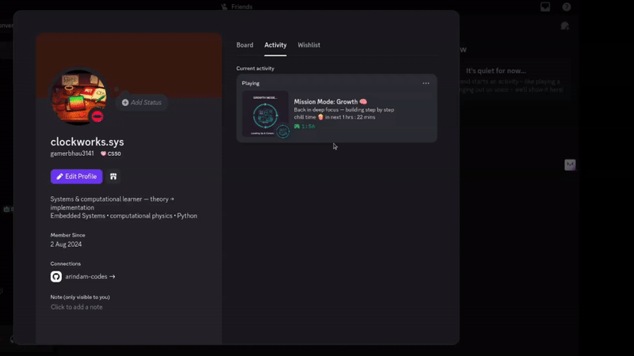
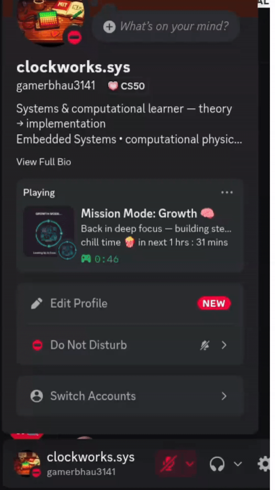
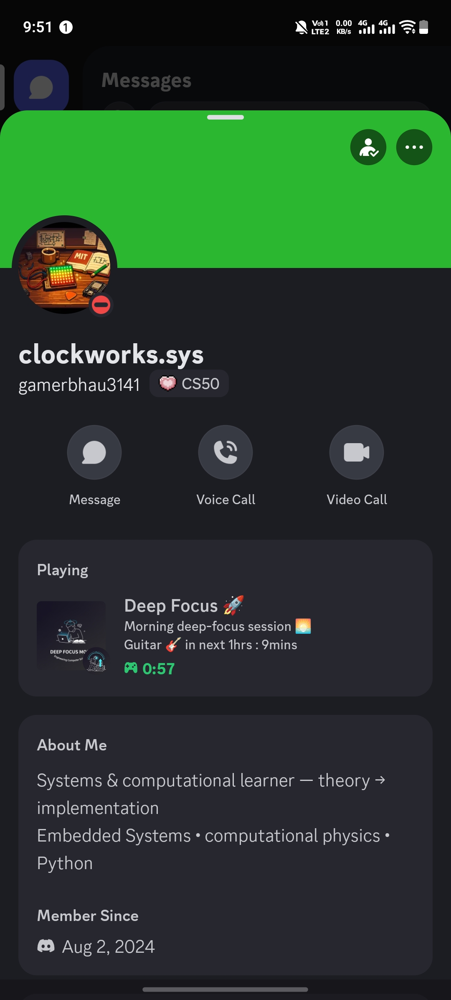
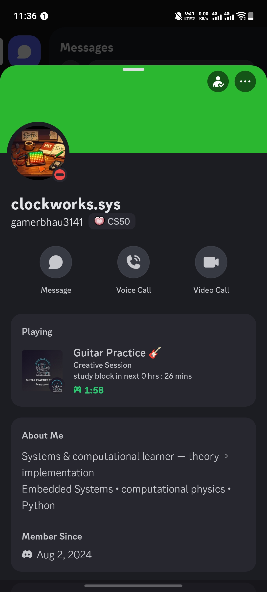
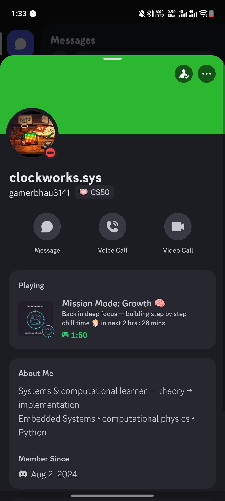

# DayFlow RPC

**A time-aware Discord Rich Presence that mirrors my daily routine**

> My first real-world Python project after completing **MIT 6.100L (Introduction to Computer Science and Programming)**.

---

i follow a strict daily routine (study blocks, guitar practice, gym, rest), and i had a fight with my girl so i thoguht to make this for her 

since we already communicate on discord, i decided to use **Discord Rich Presence** as a passive, always-available signal of:
- what I’m currently doing
- how long this state will last
- what comes next

---

## Key ideas used

- **Finite State Machine**  
- **Time quantization**  
- **External system constraints**  
- **Human-centric design**  
- **Day rollover handling**  
---

## How it works (high level)

Current Time
to
Mode Selector (state machine)
to
Time Remaining Calculation
to
Discord Rich Presence Update

The program runs continuously and updates only when it is safe and meaningful.

---

## Example modes

- Deep Focus 🚀 (study)
- Guitar Practice 🎸
- Mission Mode: Growth 🧠
- Chill Time 🍿
- Gym 🏋️‍♂️
- Unwind & Reset 🌙
- Sleep 💤

Each mode includes:
- a clear label
- a description
- an end time
- a countdown to the next state

---

## Live Demo (Auto-Updating)

### Desktop View

  

---

### Mobile View

  

---

> The countdown and mode transitions are driven entirely by local time logic.  
> No messages, bots, or manual updates are involved.

---

## Demo (Live Discord Presence)

### Deep Focus Mode 🚀

  

*Focused study block with a live countdown to the next activity.*

---

### Guitar Practice 🎸

  

*Automatically switches when the time window changes.*

---

### Mission Mode: Growth 🧠

  

*Long deep-work sessions with accurate remaining time display.*

---

## Tech stack

- Python 3
- `pypresence` (Discord Rich Presence)
- Standard library only (`datetime`, `time`, `math`)

No frameworks. No databases. No web servers.

---

## 👥 Who is this for?

- Beginners learning Python through real projects  
- Developers exploring Discord Rich Presence  
- Anyone interested in automation and productivity systems  
- Students learning state machines and time-based logic  

---

## What I learned from this project

- Real systems are more about **state and timing** than syntax
- External systems don’t always reflect updates instantly
- Designing for **human reassurance** changes technical decisions
- Handling time correctly is harder than it looks
- Small, useful tools teach more than large demo projects

---

🕯️ final Note
this project is not about productivity or automation alone.

its about using code to reduce unnecessary worry, improve clarity, and make daily life a little calmer for both myself and the people close to me.

---

## 🔍 Keywords

python automation project  
discord rich presence python  
beginner python project ideas  
daily routine tracker python  
time based state machine python  
productivity automation tools  
